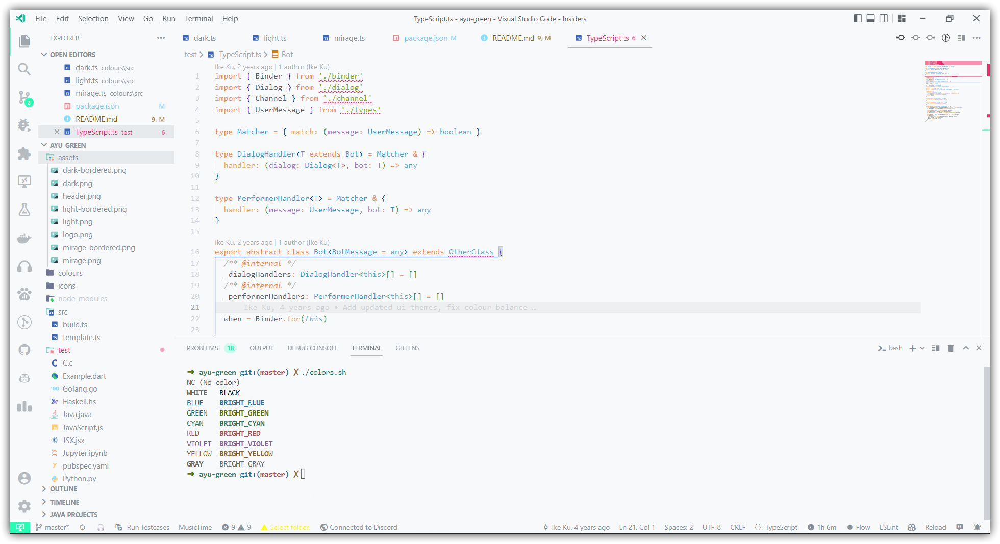
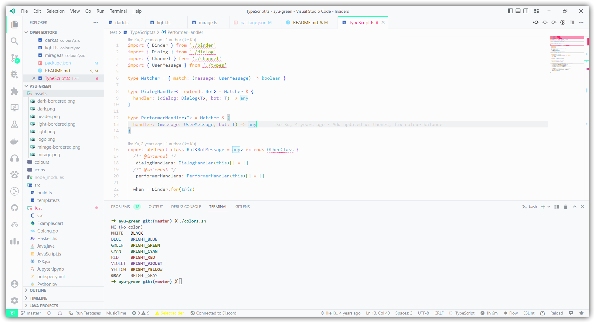
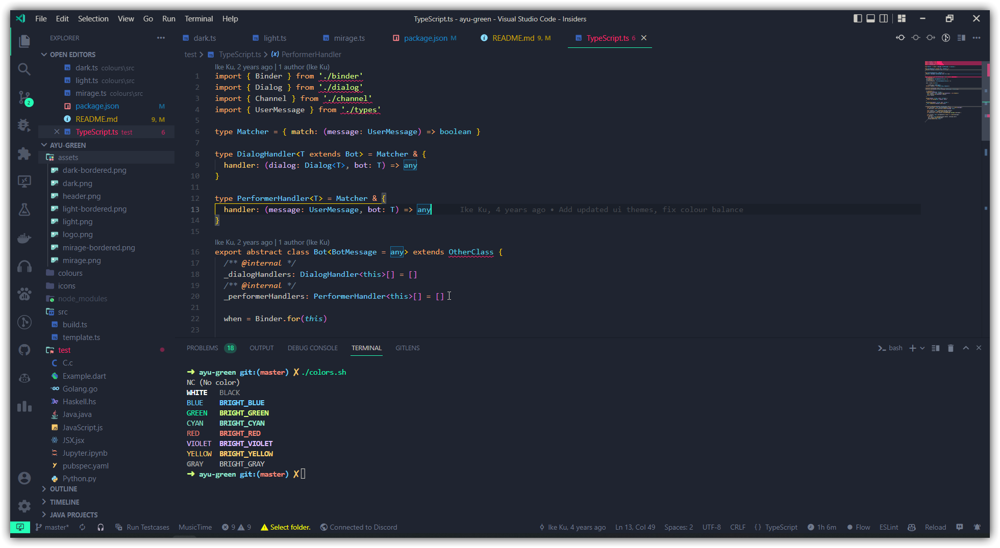
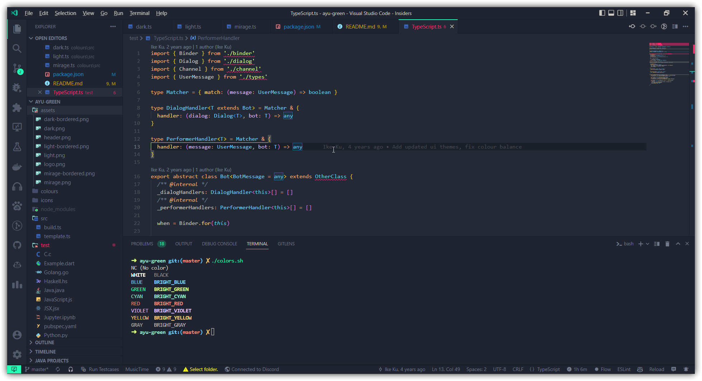
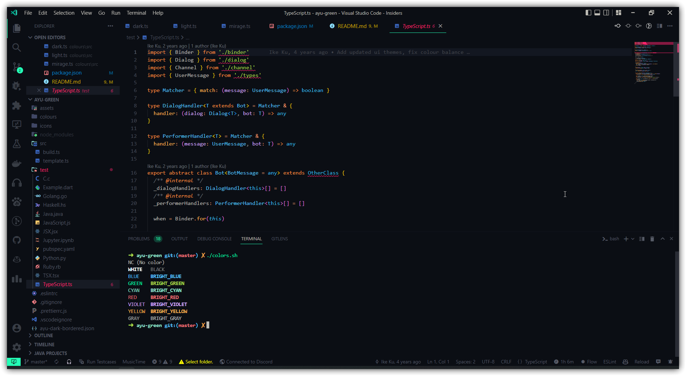
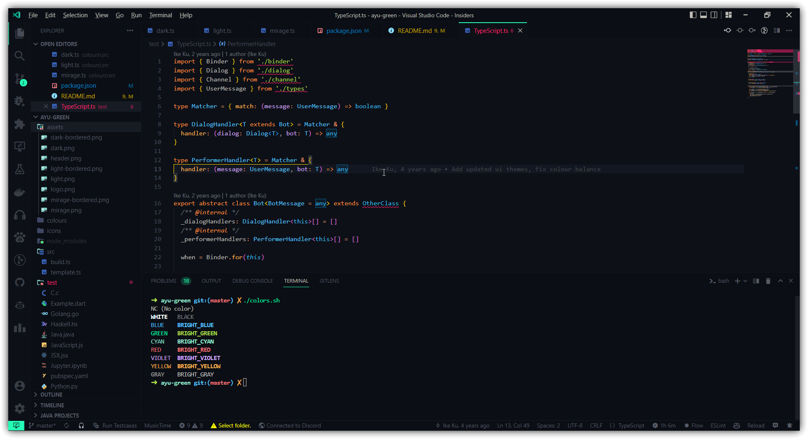

> Source from: https://github.com/dempfi/ayu

Modified version of the Ayu theme with green accents.
## Screenshots

#### Light



#### Mirage



#### Dark



## Development

Install dependencies
```shell
npm install
```

Update themes and build VSIX package
```shell
npm run build && npm run package
```
