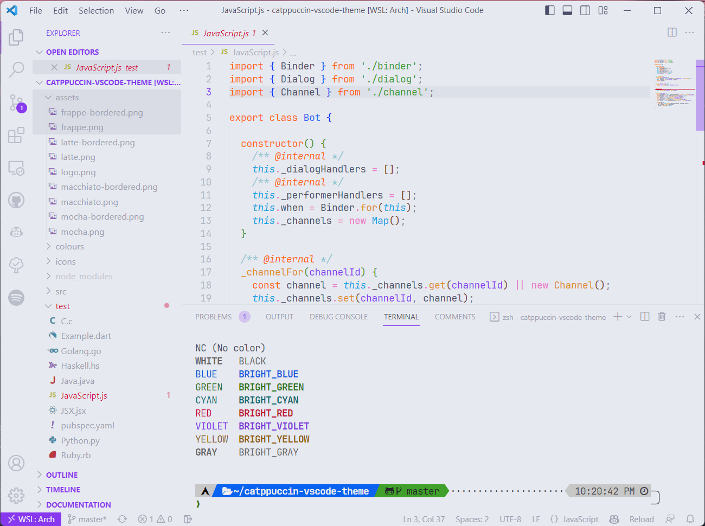
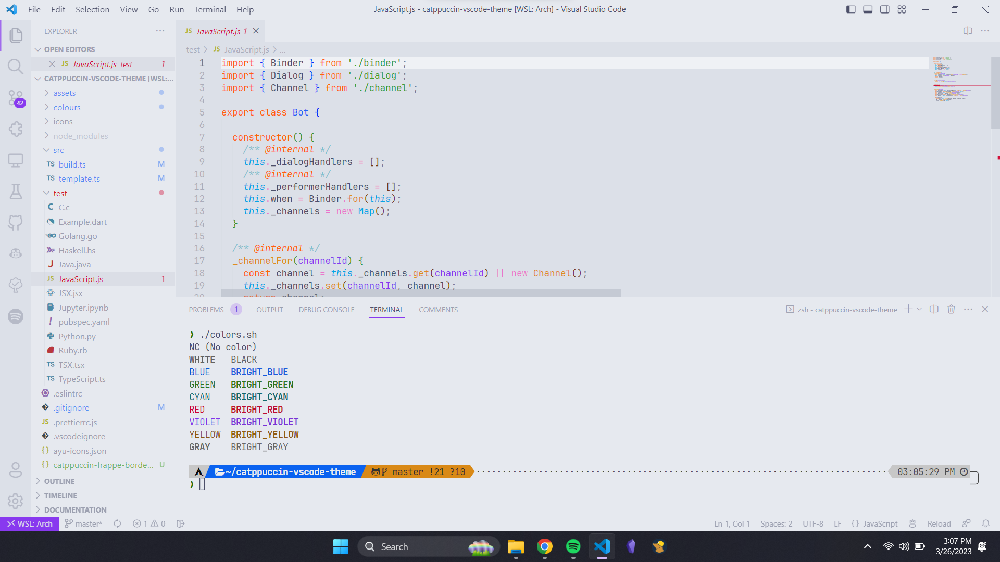
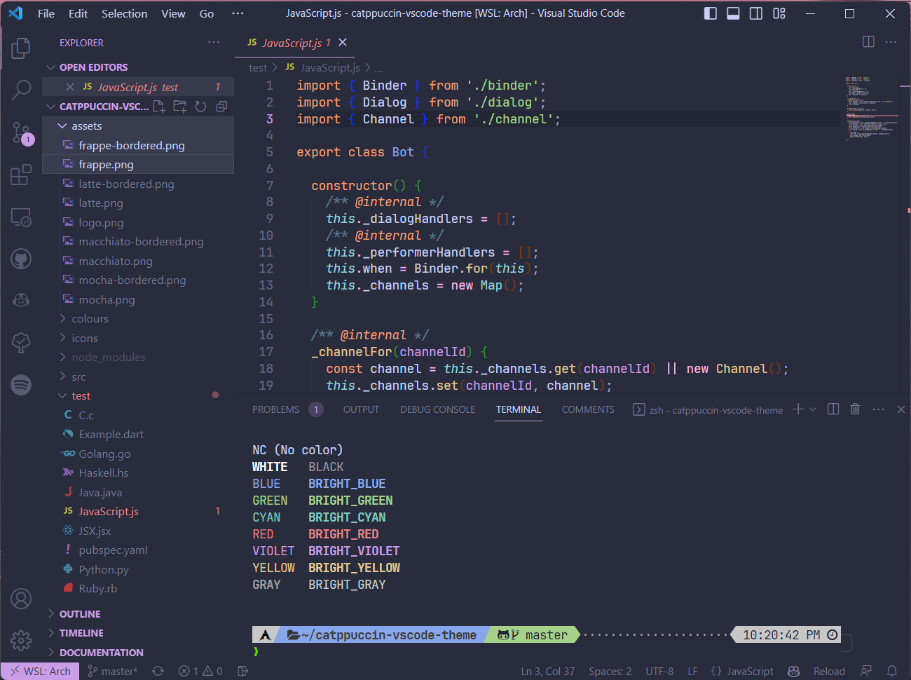
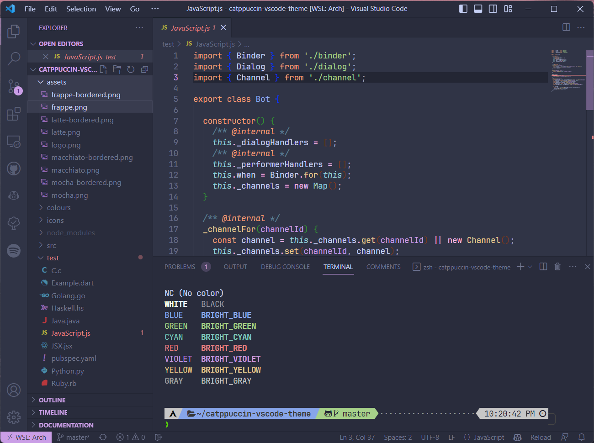
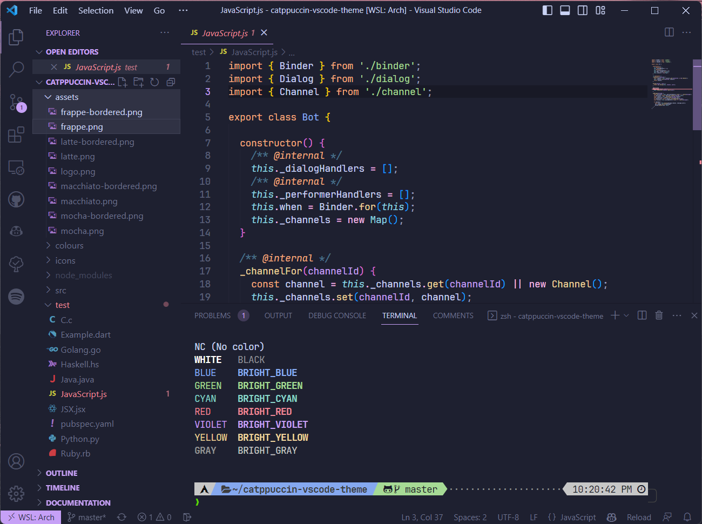
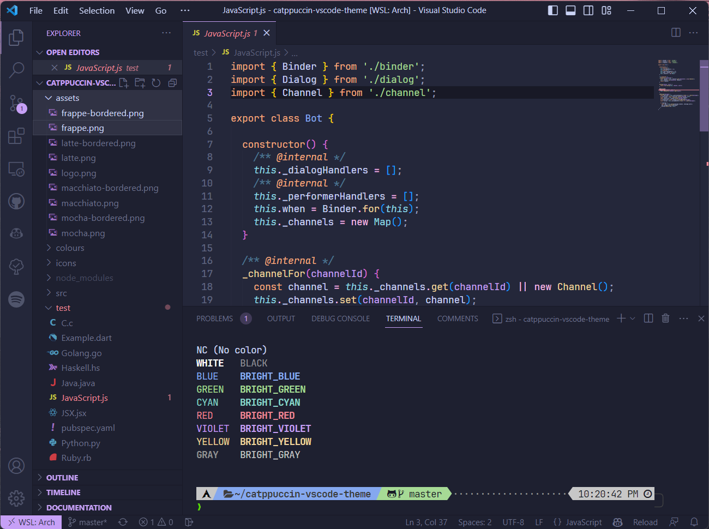
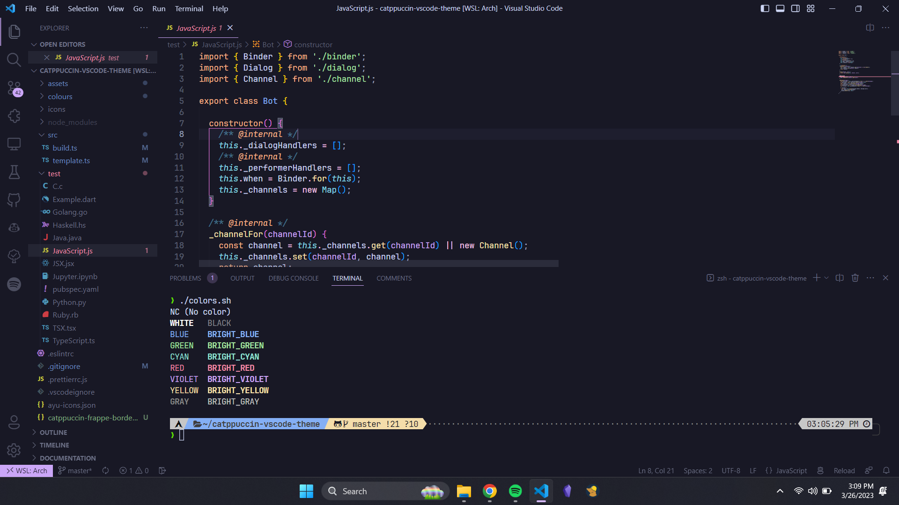
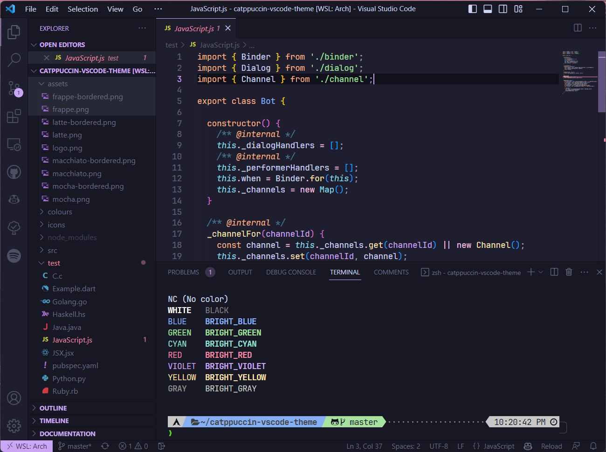

# Catppuccin VSCode Theme


## Installation

- Install the theme from the [VSCode Marketplace](https://marketplace.visualstudio.com/items?itemName=Siris01.catppuccin-theme)

## Credits

- [catppuccin](https://github.com/catppuccin/catppuccin) - Color scheme
- [ayu-colors](https://github.com/ayu-theme/ayu-colors) - Build scripts and color modification libraries
- [vscode-ayu](https://github.com/ayu-theme/vscode-ayu) - Icons + VSCode theme template

## Screenshots

### Latte




### Frappe




### Macchiato




### Mocha




## Development

- Install dependencies

```shell
pnpm install
```

- Update themes and build VSIX package

```shell
pnpm start
```
